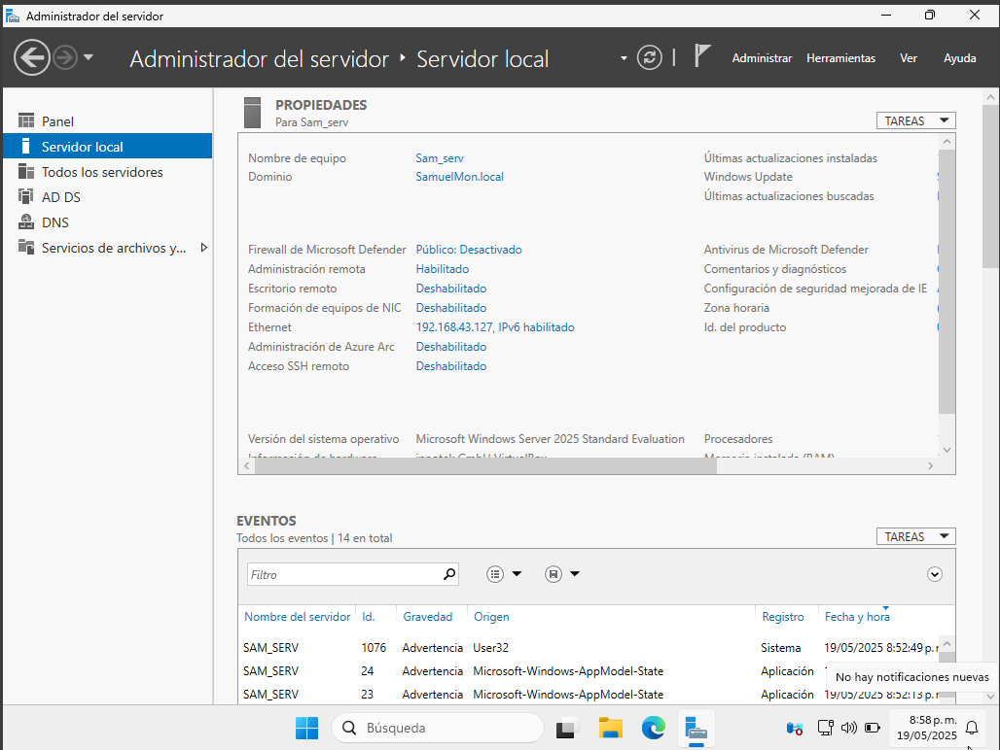
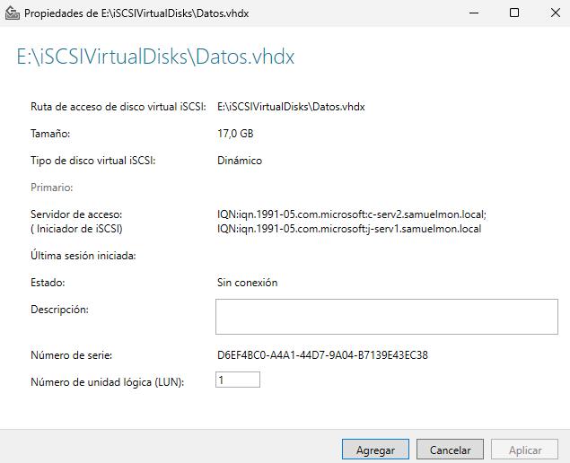
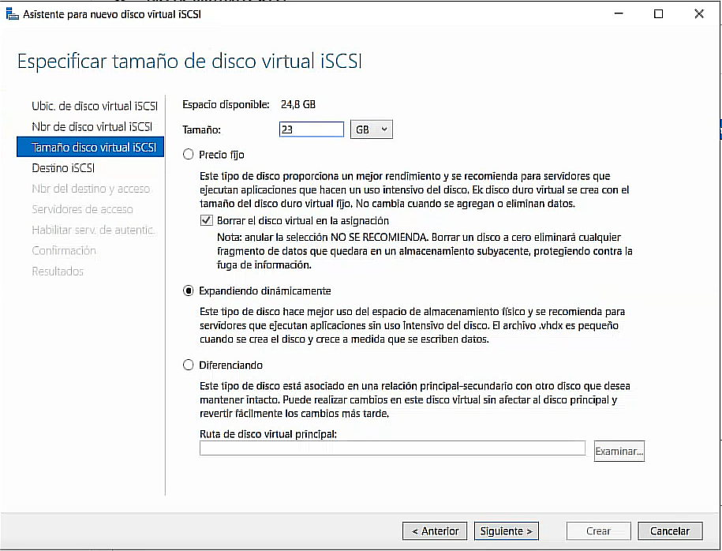
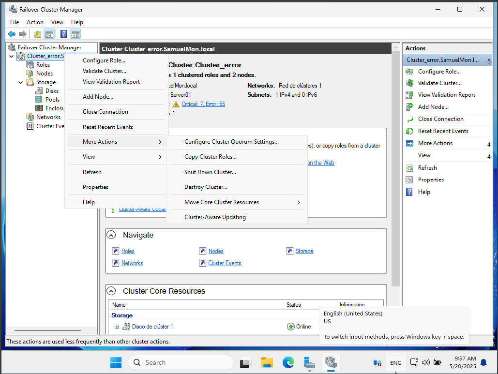
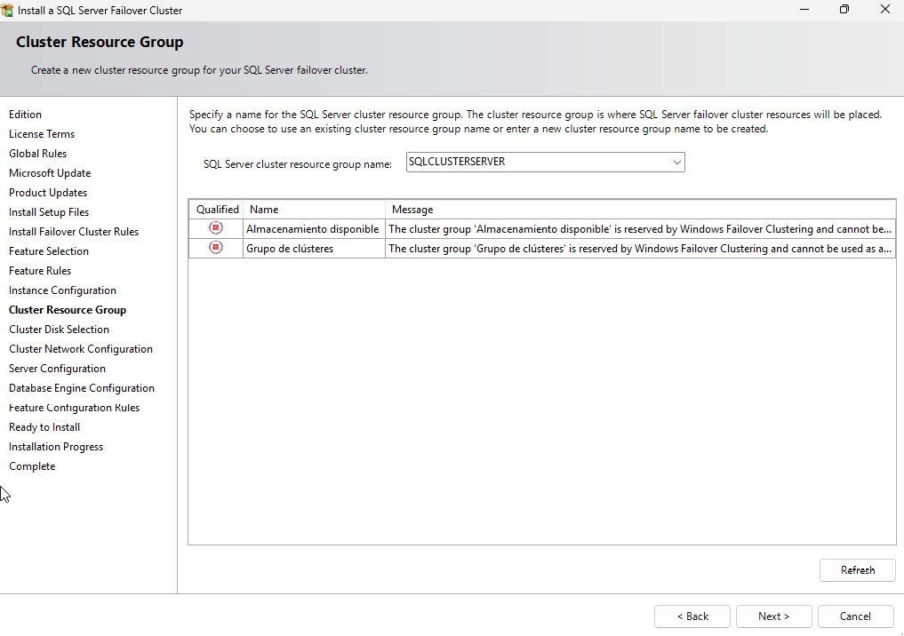
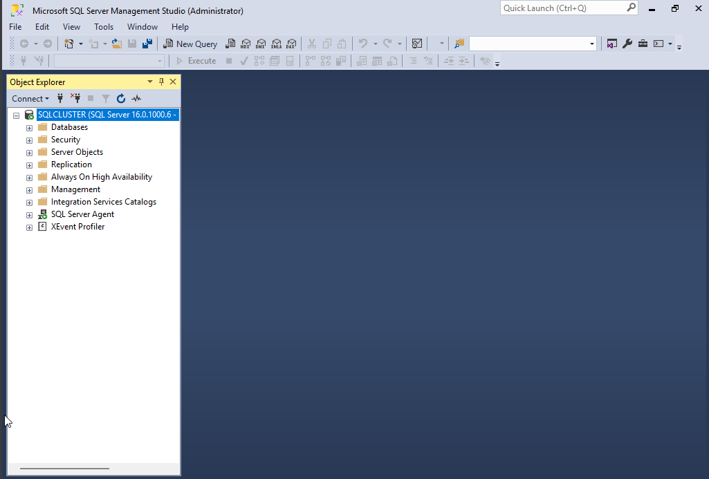

# Implementación de un Clúster de Conmutación por Error en Windows Server 2025 con SQL Server 2022

## Introducción

Los sistemas informáticos empresariales modernos exigen altos niveles de disponibilidad y fiabilidad, especialmente en servicios críticos como bases de datos. La interrupción de estos servicios puede causar pérdidas económicas, daño reputacional y baja productividad. En este contexto, los clusters de conmutación por error se han vuelto esenciales para infraestructuras de TI robustas.

Windows Server 2022 ofrece capacidades avanzadas para implementar clusters de conmutación por error, permitiendo que los servicios críticos sigan funcionando incluso si uno de los nodos falla. Este trabajo explora la implementación práctica de esta tecnología para garantizar la alta disponibilidad de servicios SQL Server, mostrando cómo configurar, administrar y mantener un entorno de cluster eficiente.

La relevancia de este estudio radica en proporcionar una guía aplicada para profesionales de TI que buscan fortalecer la resiliencia de sus infraestructuras de servidor y bases de datos, contribuyendo así a la continuidad del negocio en entornos donde el tiempo de inactividad no es una opción viable.

## Objetivos

**Objetivo General:**

Implementar y configurar un cluster de conmutación por error en Windows Server 2022 para garantizar la alta disponibilidad y tolerancia a fallos de servicios críticos de bases de datos SQL Server.

**Objetivos Específicos:**

1. Analizar los conceptos fundamentales y componentes de un cluster de conmutación por error en entornos Windows Server.
2. Configurar el entorno de laboratorio con dos servidores físicos y dos máquinas virtuales, estableciendo el almacenamiento compartido necesario para el funcionamiento del cluster.
3. Implementar la función de conmutación por error de Windows Server y crear la estructura del cluster con su configuración de quorum apropiada.
4. Instalar y configurar SQL Server en las máquinas virtuales del cluster para habilitar la conmutación por error de las bases de datos.
5. Realizar pruebas de conmutación por error para verificar la funcionalidad y eficacia del cluster implementado.
6. Establecer protocolos de monitoreo y resolución de problemas para garantizar el mantenimiento efectivo del cluster en un entorno de producción.

## 1. Preparación del Entorno

### 1.1 Creación de la primera máquina virtual (Directorio Activo)

1. **Crear la máquina virtual:** Será el Directorio Activo donde se conectarán las otras dos máquinas virtuales.
2. **Cambiar el nombre y asignar IP estática:**
   - Cambia el nombre de la máquina y asigna una IP estática.
   - 
   - 

3. **Agregar roles y características:**
   - Ve a "Agregar roles y características".
   - 
   - Selecciona "Servicios de Dominios de Active Directory".
   - 

4. **Instalación y configuración del dominio:**
   - Espera la confirmación de la instalación.
   - 
   - Configura el dominio desde el icono de la bandera.
   - 
   - 
   - Revisa las propiedades del servidor.
   - 

### 1.2 Configuración del almacenamiento compartido (ISCSI)

1. **Crear almacenamiento ISCSI:**
   - Apaga la máquina, ve a VirtualBox > Configuración > Almacenamiento.
   - Selecciona el controlador LSIlogic y crea un nuevo disco duro.

2. **Inicializar y preparar el disco:**
   - Ve a "Administrador de equipos" > "Almacenamiento".
   - Inicializa el disco con la opción GPT.
   - 
   - 
   - 
   - 

3. **Crear volumen simple:**
   - Asigna la letra E y el nombre "Sharing".
   - 
   - 
   - 
   - 

### 1.3 Configuración de las máquinas virtuales clientes

#### Segunda máquina virtual

1. Cambia el nombre y asigna IP estática.
2. Configura el DNS con la IP del Directorio Activo.
3. Une la máquina al dominio principal.
   - 
   - 
   - 

#### Tercera máquina virtual

1. Cambia el nombre y asigna IP estática.
2. Configura el DNS con la IP del Directorio Activo.
3. Une la máquina al dominio principal.
   - 
   - 
   - 
   - 

### 1.4 Configuración del rol ISCSI y discos compartidos

1. **Desplegar el rol ISCSI:**
   - Instala el rol "Servidor de Destino".
   - 
   - 

2. **Crear y asignar destino ISCSI:**
   - Selecciona la partición creada y asígnale un tamaño de 1GB.
   - 
   - 

3. **Agregar destino ISCSI a las máquinas:**
   - 
   - 
   - 
   - Añade los nombres de las máquinas para obtener el IQN.
   - 
   - 

4. **Inicializar ISCSI en los clientes:**
   - Abre "Herramientas de Windows" > "Inicializador ISCSI".
   - 
   - En destino, pon la IP de la máquina principal y autoconfigura.
   - 
   - 
   - Inicializa y asigna letra y nombre al volumen.
   - 
   - 

5. **Repetir proceso en la segunda máquina cliente.**

6. **Crear un nuevo disco virtual ISCSI:**
   - Repite el proceso, asigna nombre y tamaño (23GB).
   - 
   - 
   - 
   - 
   - 
   - 
   - 
   - 
   - 

7. **Inicializar y montar el disco en los clientes:**
   - Repite el proceso de inicialización y asignación de nombre "Datos".

### 1.5 Instalación del rol de clúster y despliegue

1. **Instalar el rol de clúster:**
   - En una de las máquinas, instala el rol "Cluster de Conmutación por Error".
   - 
   - 
   - 
   - 

2. **Crear el clúster:**
   - Abre el Administrador de clústeres de conmutación por error.
   - Selecciona "Crear clúster" y sigue el asistente:
     - Selecciona los nodos.
     - Valida la configuración.
     - Asigna nombre y dirección IP al clúster.
     - Configura el quorum (elige el disco testigo).

> **Nota:** Antes de crear el clúster, asegúrate de:
>
> - Tener al menos dos nodos unidos al mismo dominio.
> - Haber configurado almacenamiento compartido (iSCSI).
> - Contar con una red confiable entre los nodos.
> - Tener habilitada la característica "Clúster de conmutación por error".
---

## Configuración avanzada del Quorum y adaptadores de red

### Configuración del Quorum en el clúster

1. En el clúster, accede a las opciones adicionales en la parte izquierda del administrador y elige la opción "Configurar los ajustes del Quorum del clúster".
   - 
2. Elige la configuración avanzada de Quorum.
   - 
3. Asigna los nodos que van a votar en el clúster.
   - 
4. Elige la opción de configurar un testigo de disco.
   - 
5. Selecciona el disco Quorum (en este caso, el disco de clúster 1).
   - 
6. En la siguiente pantalla, solo confirma y haz clic en "Next". Ya habrás configurado el Quorum de forma satisfactoria. Para finalizar, haz clic en "Finalizar".
   - 

---

## Instalación de SQL Server 2022 y SQL Server Management Studio (SSMS)

Instalamos SQL Server 2022 como una instancia del clúster seleccionando "New SQL Server failover Cluster installation" en el instalador de SQL Server.
   - 
   - 
   - 
   - 
   - 
   - 
   - 
   - 
   - 
   - 
   - 
   - 

Damos permisos a todos para actuar en el almacenamiento compartido que se usó en el SQL Server 2022.
   - 

Descargamos e instalamos SQL Server Management Studio (SSMS) en los nodos.
   - 

Nos conectamos al clúster con SQL Server Management Studio (SSMS).
   - 
   - 

Le damos permisos a los usuarios desde SQL Server Management Studio (SSMS).
   - 

---

### Configuración de adaptadores de red y creación de la base de datos

1. Crea otro adaptador de red en VirtualBox:
   - 
2. Asigna una IP estática al nuevo adaptador:
   - 
3. Verifica la configuración en el clúster:
   - 
4. Crea la base de datos Escuela_Futbol:
   - 
5. En el otro nodo, realiza la instalación "Add node to a SQL Server failover cluster":
   - 
6. Proceso de instalación en el nodo:
   - 
   - 
   - 
   - 

---

Como se ve, se puede mover el rol del SQLCLUSTERSERVER entre los nodos sin problemas, por lo que si uno falla el rol puede moverse al otro.
   - 
   - 
   - 

---
## Conclusión

La implementación del clúster de conmutación por error en Windows Server 2025 con SQL Server 2022 permitió garantizar la alta disponibilidad y la tolerancia a fallos de los servicios críticos de bases de datos. Se logró configurar correctamente el almacenamiento compartido, el Quorum, la instalación de SQL Server en modo clúster, la gestión de usuarios y la creación de la base de datos, así como la validación de la conmutación de roles entre nodos. El sistema resultante asegura la continuidad operativa y minimiza el tiempo de inactividad ante fallos, cumpliendo con los objetivos de resiliencia y robustez requeridos en entornos empresariales.

---

**Autores:**

- Samuel David Montenegro Gómez
- Juan Pablo Mosquera Hinestroza
- Juan David Vidal Canizales

**Institución Universitaria Antonio José Camacho**
Facultad de Ingenierías, Ingeniería en Sistemas, 2025
